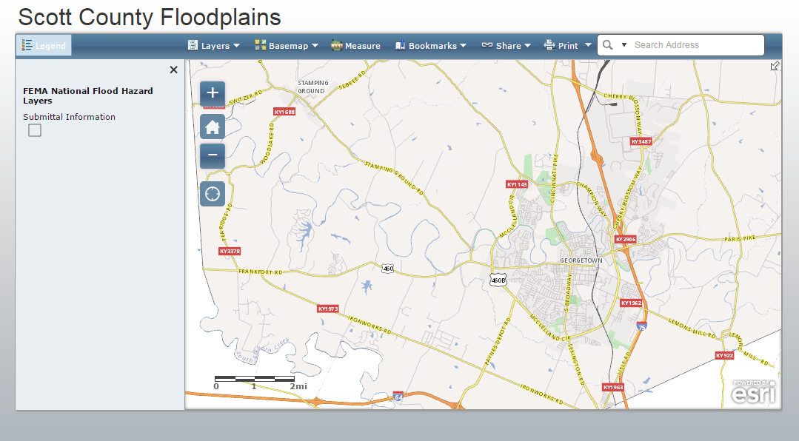
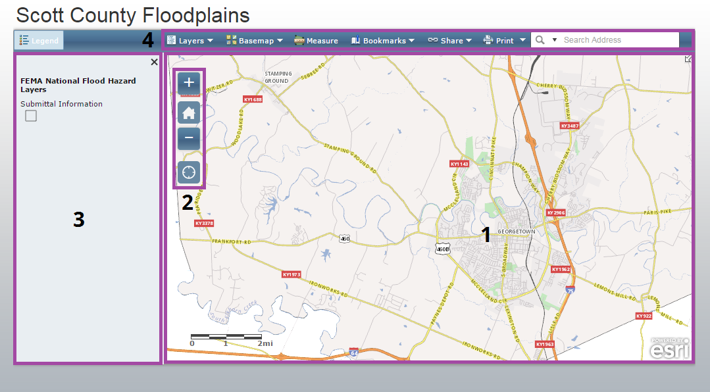
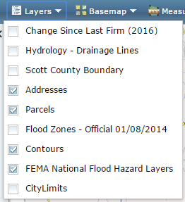
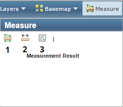

## Introduction

In this tutorial we'll explore the Scott County Floodplain interactive map. We'll take a tour of the different parts that make up the map as well as demonstrate how to search the map by address, toggle various data layers, and print a map view. The first thing you'll need to do is navigate to the map. You can do this a couple of different ways:

- Go to [http://gis.gscplanning.com/floodplain](http://gis.gscplanning.com/floodplain).
- Through our website, [http://www.gscplanning.com](http://www.gscplanning.com), click on the **GIS** tab. On the GIS page, click on the *Flood Zones* icon: 

## Tour the Map

Here's the initial view you'll see when you load the map. It depicts a map of Scott County and not much else:

There are four main elements to this map:

1. **Map Pane:** The visible area of the map. You can use your mouse to pan and zoom to change the map view or use the zoom controls (2).
2. **Zoom Controls:** Some buttons for changing the zoom level and extent of the map.
3. **Legend:** Shows what layers are visible in the map. As you zoom in/out and toggle layers, this will update to show which layers are visible.
4. **Toolbar:** A few tools to enrich your interaction with the map. We'll take a closer look at these in a moment.

## Toolbar

Let's take a closer look at the tools in the toolbar. The toolbar contains seven tools:

Let's take a look at each tool.

### Layers

The **Layers** tool lets you toggle layers on and off. Beyond floodplain boundaries, this map comes loaded with addresses, parcel boundaries, contour lines, and more.

Click the check boxes to toggle on and off to tune your map to your particular needs.

*Note, that you can only toggle layers one at a time. After each toggle, the **Layers** dropdown will disappear and you'll have to click it again to toggle on/off another layer.*

### Basemap

Basemaps are a reference layer atop which the other layers are draped. Basemaps add general geographic context and make it a little easier to understand how the features in each layer relate to one another and the surrounding area. There are several basemap options, including a couple that show aerial imagery.

### Measure

The **Measure** tool gives you options to measure area (1), distance (2), and location (3) in your map.

### Bookmarks

Much like you use a bookmark to recall a place in a book, the **Bookmarks** tool offers the ability to go to some commonly visited locations. Our maps typically include bookmarks for Georgetown, Sadieville, Stamping Ground, and Scott County.

### Share

You can use the **Share** tool to pass along a view of the map to other people.

### Print

The **Print** tool allows you to create a printable PDF version of the current map view. There are a variety of page sizes to choose from.

### Search

If you know an address that you want to view on the map, you can input it into the **Search** tool. Through a process called *geocoding*, it will attempt to zoom to and center the map to your searched location.

*Note: While the geocoder we use is powerful, the lack of a national or global standard for addressing makes this an imprecise process. The Search tool will attempt to get you close to the address you inputed, but be prepared for errors.*

## How do I do that?

These short videos demonstrate how to get the most out of this app by showing some commonly used functionality.  

### Search an address

  <iframe width="800" height="450" src="https://www.youtube.com/embed/y6yMDUaOLx8" frameborder="0" allowfullscreen></iframe>

### Toggle Layers &amp; Basemeaps

  <iframe width="800" height="450" src="https://www.youtube.com/embed/5CzbSIu6fcs" frameborder="0" allowfullscreen></iframe>

### Print a Map

  <iframe width="800" height="450" src="https://www.youtube.com/embed/I23z2r8zdyU" frameborder="0" allowfullscreen></iframe>

